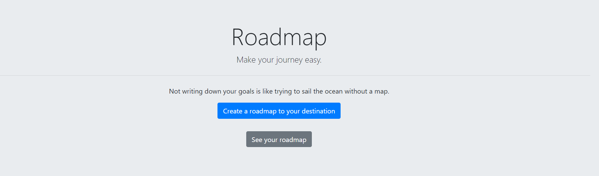
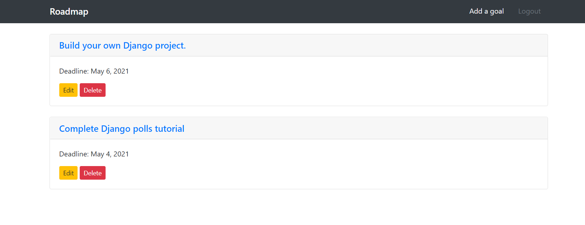
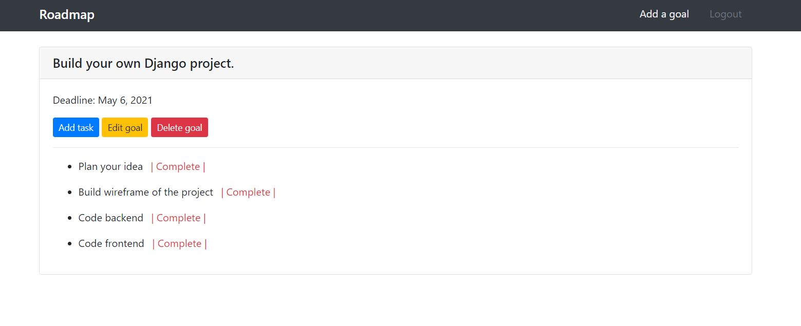

# Roadmap
**Make your journey easy.**

### How to use Roadmap
1. Go to [Roadmap](https://your-roadmap.herokuapp.com/)
2. Click [Create a roadmap to your destination](https://your-roadmap.herokuapp.com/accounts/signup/) and create new account.
3. Login to Roadmap.
4. Create new Goal.
5. Go to specific goal.
6. Create tasks to achieve that goal.

### Roadmap screenshots
Index page

Goal page

Goal page with tasks
